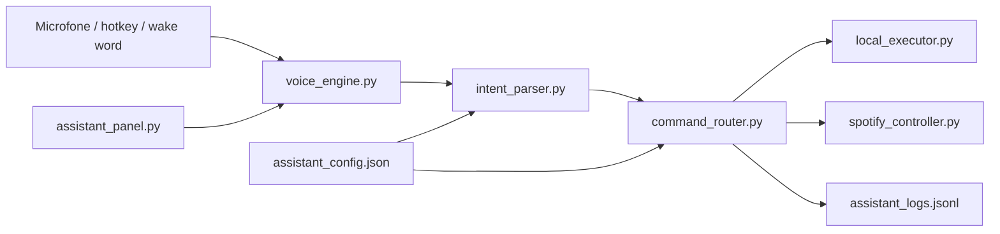

# Jarvis Assistant

Assistente local de controle por voz para Windows, em portugues-BR. O foco do projeto e transformar fala em comandos reais para o PC: abrir aplicativos, sites, pastas, pesquisar, controlar Spotify, ajustar volume e executar rotinas.

O app principal e o core Python com Vosk offline. O prototipo Tauri em `assistant-desktop/` existe apenas como experimento visual.

## Status

Alpha funcional.

- Core Python real: ativo.
- Voz offline com Vosk: ativo.
- Hotkey + wake words: ativo.
- Executor local Windows: ativo.
- Spotify por URI, busca e teclas de midia: ativo.
- Tauri/React: experimental.

## Quickstart

```bat
python -m venv .venv
.venv\Scripts\activate
python -m pip install -r requirements.txt
python assistant_panel.py
```

Ou rode:

```bat
start-jarvis.bat
```

Na primeira execucao de voz, o app baixa o modelo Vosk portugues `vosk-model-small-pt-0.3`.

## Comandos de exemplo

```text
abre o Chrome
abre YouTube
pesquisa Python no Google
toca playlist foco
pausa Spotify
proxima musica
aumenta volume
ativar modo estudo
listar comandos
```

## Build Windows

```bat
build.bat
```

Saida:

```text
dist\JarvisAssistant.exe
dist\WorkspaceLauncher.exe
dist\WorkspaceConfig.exe
dist\assistant_config.json
dist\workspace-config.json
```

## Estrutura

```text
assistant_panel.py        Painel principal do assistente de voz
voice_engine.py           Microfone, Vosk, wake words e hotkey
intent_parser.py          Parser local de comandos em portugues-BR
command_router.py         Orquestrador seguro de intencoes e acoes
local_executor.py         Executor Windows: apps, sites, pastas, volume, clipboard
spotify_controller.py     Controle Spotify por URI, busca e teclas de midia
assistant_config.json     Configuracao do assistente
workspace.py              Launcher legado e compatibilidade
config_gui.py             Configurador legado
assistant-desktop/        Prototipo visual Tauri/React experimental
docs/                     Documentacao tecnica
tests/                    Testes automatizados
```

## Arquitetura



## Configuracao

Edite `assistant_config.json` para adicionar apps, sites, pastas, playlists e rotinas.

OpenAI e opcional. Se `usar_openai` for ativado, defina a chave via variavel de ambiente:

```bat
set OPENAI_API_KEY=sk-sua-chave
```

Sem OpenAI, os comandos essenciais continuam funcionando pelo parser local.

## Validacao

```bat
python -m py_compile assistant_panel.py voice_engine.py intent_parser.py command_router.py local_executor.py spotify_controller.py workspace.py config_gui.py config_utils.py clap-trigger.py voice-trigger.py
python -m pytest
```

Para tooling de desenvolvimento:

```bat
python -m pip install -r requirements-dev.txt
```

## Documentacao

- [Arquitetura](docs/ARCHITECTURE.md)
- [Setup](docs/SETUP.md)
- [Comandos](docs/COMMANDS.md)
- [Modelo de seguranca](docs/SECURITY_MODEL.md)
- [Release](docs/RELEASE.md)
- [Roadmap](ROADMAP.md)

## Seguranca

O app executa acoes locais no computador, entao o projeto evita shell livre no MVP. Comandos desconhecidos falham de forma segura, acoes sensiveis devem pedir confirmacao e logs locais sao ignorados pelo Git.

Veja [SECURITY.md](SECURITY.md).

## Licenca

MIT. Veja [LICENSE](LICENSE).
