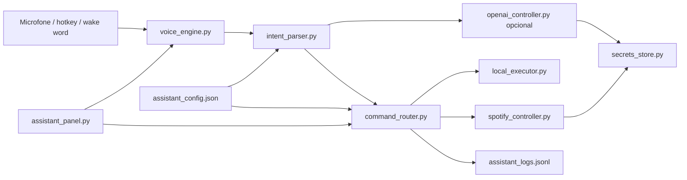

# Arquitetura

## Visao geral

O projeto tem um nucleo Python real para controle do PC por voz e texto. A interface Tauri existe como experimento visual, mas nao e o produto principal. O produto oficial e o painel `assistant_panel.py`, que organiza comandos, voz, rotinas, Spotify, integracoes e logs em uma experiencia de desktop.

## Modulos principais

- `assistant_panel.py`: janela principal profissional com Inicio, Assistente, Spotify, Rotinas, Voz e audio, Integracoes, Configuracoes e Logs.
- `voice_engine.py`: captura de audio, Vosk offline, wake words, hotkey, selecao de microfone e nivel de entrada.
- `intent_parser.py`: converte texto em `CommandIntent`, incluindo comandos compostos como "abrir Chrome e Spotify".
- `command_router.py`: valida intencao, cria `ActionSpec`, pede confirmacao quando necessario e executa com seguranca.
- `local_executor.py`: integra com Windows para apps, sites, YouTube, pastas, fechar apps, volume e clipboard.
- `spotify_controller.py`: controla Spotify por URI/teclas de midia e Web API via OAuth PKCE quando conectado.
- `openai_controller.py`: usa OpenAI Responses API opcionalmente para interpretar frases vagas e gerar respostas curtas.
- `secrets_store.py`: salva chaves/tokens fora do JSON, usando keyring quando disponivel ou DPAPI no Windows.
- `workspace.py`: launcher legado e camada de compatibilidade.

## Contrato de comando

1. Voz ou texto entra como frase natural.
2. Parser cria uma intencao estruturada.
3. Router cria uma acao segura.
4. Executor roda a acao ou pede confirmacao.
5. Resultado e salvo nos logs.

## Regras de seguranca

- A IA nao executa shell livre.
- Comandos desconhecidos falham de forma segura.
- Tokens e chaves nao sao gravados nos logs.
- OpenAI e Spotify sao opcionais; comandos essenciais continuam locais.
- Rotinas salvas guardam `ActionSpec`, nao texto arbitrario para shell.
