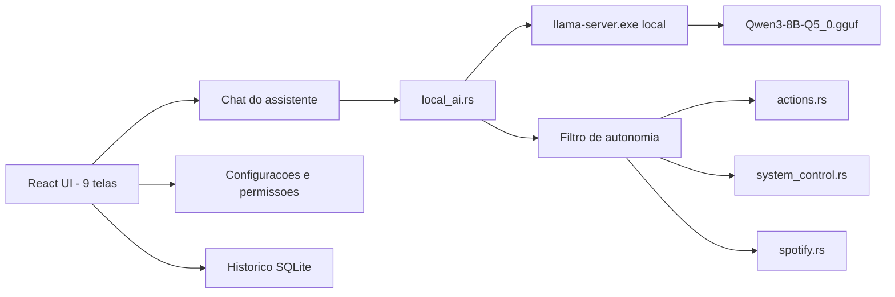

# Arquitetura

## Visao Geral

O produto principal e o app Tauri/React em `assistant-desktop/`. A V1 usa `Qwen3-8B-Q5_0.gguf` via `llama.cpp` embutido, abre sem conta e executa acoes comuns do Windows automaticamente. Google fica opcional para sincronizacao futura.

## Modulos Principais

- `assistant-desktop/src/App.tsx`: interface V1 com Inicio, Assistente IA, Controle do PC, Aplicativos, Musica, Voz, Automacoes, Historico e Configuracoes.
- `assistant-desktop/src-tauri/src/local_ai.rs`: inicia `llama-server`, envia prompt ao Qwen e valida JSON de acoes.
- `assistant-desktop/src-tauri/src/system_control.rs`: volume, screenshots, apps e processos do Windows.
- `assistant-desktop/src-tauri/src/actions.rs`: executor local e filtro de acoes sensiveis.
- `assistant-desktop/src-tauri/src/storage.rs`: SQLite local para mensagens, rotinas, logs, settings e perfil Google opcional.
- `assistant-desktop/scripts/prepare-llama-runtime.ps1`: copia o GGUF e baixa/prepara `llama-server.exe`.

## Fluxo De Comando

1. O usuario digita ou envia um comando por push-to-talk.
2. `local_ai.rs` garante que o `llama-server` esta rodando em `127.0.0.1:18181`.
3. O Qwen recebe prompt de sistema + catalogo de ferramentas.
4. O modelo deve retornar JSON com `assistant_reply` e `actions`.
5. Se o JSON for invalido, nada e executado.
6. O filtro local separa acoes comuns de acoes perigosas.
7. Acoes comuns sao executadas automaticamente; perigosas aparecem para confirmacao unica.
8. O resultado aparece no chat, logs e historico.

## Regras De Seguranca

- Nao executar PowerShell, CMD ou shell livre por decisao da IA.
- Bloquear pedidos de apagar arquivos, comprar, enviar credenciais, manipular tokens ou expor segredos.
- Pedir confirmacao para desligar, reiniciar, limpar historico e encerrar processo critico.
- Guardar no SQLite somente dados operacionais e perfil Google basico opcional.
