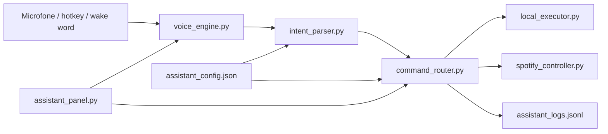

# Arquitetura

## Visao geral

O projeto tem um nucleo Python real para controle do PC por voz. A interface Tauri existe como experimento visual, mas nao e o produto principal.

## Modulos principais

- `assistant_panel.py`: painel operacional, status do microfone, ultimo comando, intencao, acao e logs.
- `voice_engine.py`: captura de audio, Vosk offline, wake words e hotkey.
- `intent_parser.py`: converte texto em `CommandIntent`.
- `command_router.py`: valida intencao, cria `ActionSpec` e executa com seguranca.
- `local_executor.py`: integra com Windows para apps, sites, pastas, volume e clipboard.
- `spotify_controller.py`: controla Spotify por URI, busca e teclas de midia.
- `workspace.py`: launcher legado e camada de compatibilidade.

## Contrato de comando

1. Voz ou texto entra como frase natural.
2. Parser cria uma intencao estruturada.
3. Router cria uma acao segura.
4. Executor roda a acao ou pede confirmacao.
5. Resultado e salvo nos logs.
